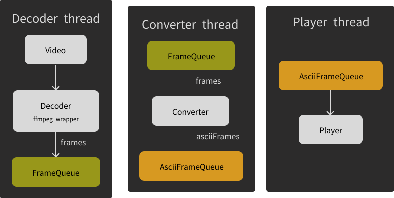

# avv : a multithreaded tool to visualize video in your terminal :crab:

## Schema



## Install

**[Ffmpeg](https://ffmpeg.org/download.html) is required to run this program**

Clone the project :

```sh
git clone https://github.com/dirdr/ascii_video_visualizer && cd ascii_video_visualizer
```

## Usage and options

```
Usage: cargo run -- [OPTIONS]

Options:
  -p, --path <PATH>                  the video path (with file extension) [default: cat.mp4]
  -m, --mode <MODE>                  the rendering mode [default: gray] [possible values: gray, color]
  -d, --detail-level <DETAIL_LEVEL>  the detail level (how many characters are used to render) [default: basic] [possible values: basic, detailed]
  -h, --help                         Print help
  -V, --version                      Print version

```

---
